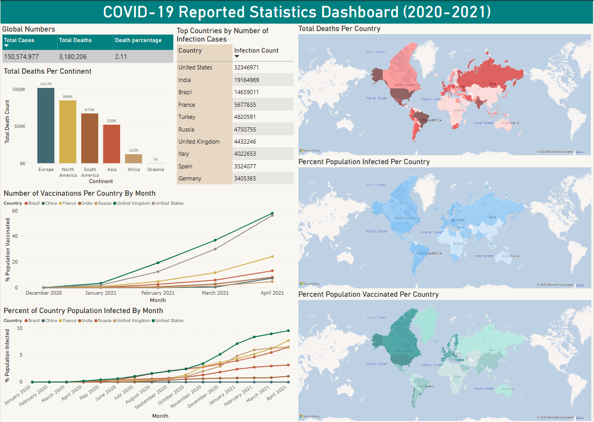

# Analyzing COVID-19 Trend Data with SQL

## Description
This project demonstrates the data analysis process of early reported data during the Covid-19 global pandemic (2020-2021) with the objective of highlighting key trends during the onset and eventual decline of the outbreak. These metrics include infection rates, death count, and vaccination coverage across individual countries, larger regions, and globally. This workflow culminates in a dynamic, comprehensible Power BI dashboard that allows users to see and interact with visualizations displaying these insights. Please see below for more details regarding the process of this data analysis workflow. 

The steps used in this workflow: 
  - The cleaning and optimization of large raw datasets to improve efficiency for processing and data manipulation in Excel. 
  - Writing the SQL queries required to extract relevant data points and trends.
  - Exporting query results as view tables so that they could be easily be integrated into Power BI.
  - Loading and transforming view tables within Power BI using tools such as DAX and Power Query to ensure data accuracy, consistency, and clarity for presentation. 
  - Creating and customizing interactive visual elements used to display and highlight important trends and insights. 
  - Compiling the visualizations into one organized, cross-filtered dashboard allowing users to intuitively interact with multiple visual elements simultaneously and understand how one metric affects another. 

## Techonologies
PostgreSQL (database and data manipulation), DataGrip (database IDE), Excel (data cleaning), Power Query (data cleaning/manipulation), DAX (data manipulation), Power BI (data visualization tool)

## Dataset:
Credit to the Our World in Data for the datasets used in this project which are available to the public here: https://ourworldindata.org/covid-deaths.

Please note the data used was taken from 2020-2021 (see [CovidDeaths.csv](Datasets/CovidDeaths.csv) and [CovidVaccinations.csv](DataSets/CovidVaccinations.csv)). 

## Dashboard
To access the dashboard, please download the [COVID_19_Dashboard.pbix](Data_Analysis/COVID_19_Dashboard.pbix) file and open it in Power BI Desktop. 

